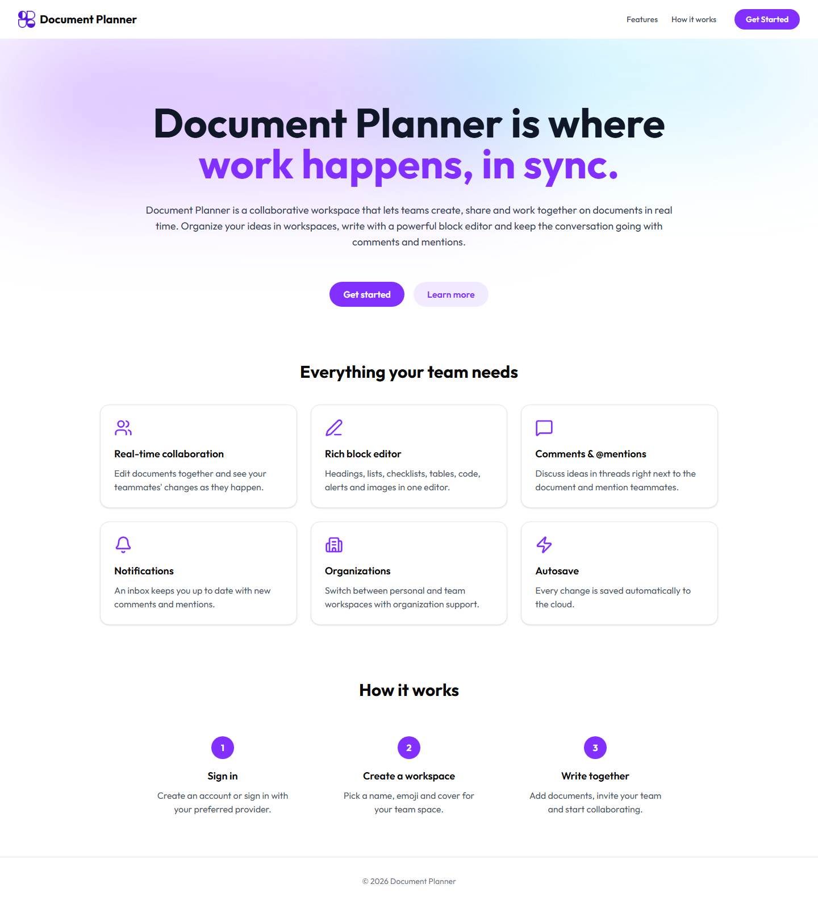
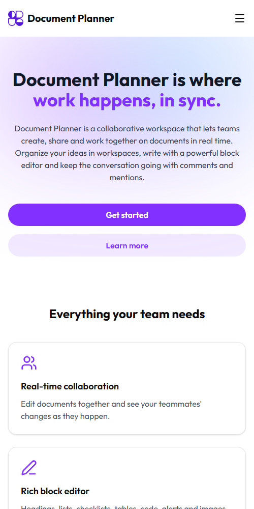
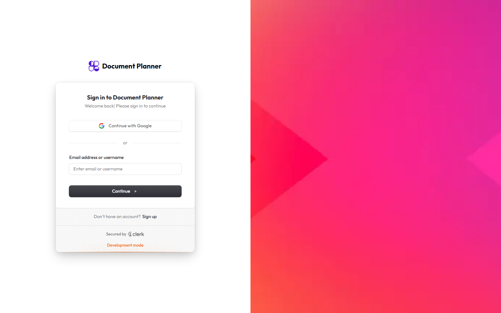
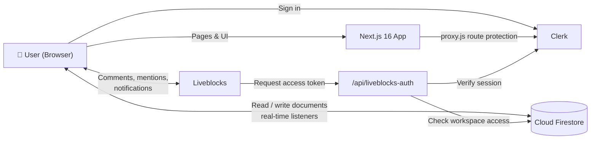
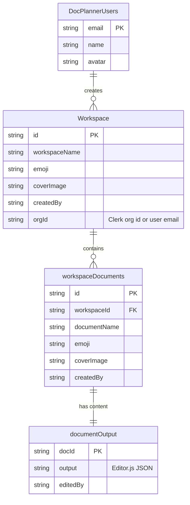

<div align="center">


# Document Planner

**A real-time collaborative document workspace for modern teams.**

Write together in a rich block editor, organize work into workspaces, discuss ideas in threaded comments with @mentions, and stay in the loop with an inbox for notifications. It works on desktop, tablet and mobile.

[**Live Demo**](https://document-planner.vercel.app/) · [**Report a Bug**](https://github.com/ethical0101/Document-Planner/issues/new?labels=bug) · [**Request a Feature**](https://github.com/ethical0101/Document-Planner/issues/new?labels=enhancement)

<br />

[](https://nextjs.org/)
[](https://react.dev/)
[](https://tailwindcss.com/)
[](https://firebase.google.com/)
[](https://clerk.com/)
[](https://liveblocks.io/)

[](LICENSE)
[](#-security)
[](#-contributing)
[](https://github.com/ethical0101/Document-Planner/stargazers)
[](https://github.com/ethical0101/Document-Planner/commits/main)

</div>

---

## 📑 Table of Contents

- [About the Project](#-about-the-project)
- [Screenshots](#-screenshots)
- [Key Features](#-key-features)
- [Tech Stack](#-tech-stack)
- [Architecture](#-architecture)
- [Getting Started](#-getting-started)
- [Environment Variables](#-environment-variables)
- [Usage](#-usage)
- [Project Structure](#-project-structure)
- [Data Model](#-data-model)
- [Available Scripts](#-available-scripts)
- [Deployment](#-deployment)
- [Security](#-security)
- [Roadmap](#-roadmap)
- [Contributing](#-contributing)
- [License](#-license)
- [Acknowledgements](#-acknowledgements)

---

## 📖 About the Project

**Document Planner** is a full-stack, Notion-style collaboration app built with the
Next.js App Router. Teams create **workspaces**, fill them with **documents**, and
edit them **together in real time**. Every document has a cover image, an emoji and
a block-based editor. Comment threads, @mentions and an inbox keep the whole team
in sync.

It shows how to put together a production-grade stack:

- **Clerk** for authentication and organizations
- **Cloud Firestore** for storage and live sync
- **Liveblocks** for comments, mentions and notifications
- **Editor.js** for rich, structured content

### Why Document Planner?

| Problem                                             | How Document Planner solves it                                     |
| --------------------------------------------------- | ------------------------------------------------------------------ |
| Notes and plans are scattered across tools          | One workspace per team or project, with every document in it       |
| Feedback gets lost in chat apps                     | Threaded comments and @mentions right next to the content          |
| You never know what changed while you were away     | A notifications inbox with an unread counter                       |
| Personal and team work get mixed                    | Clerk Organizations keep personal and team workspaces separate     |
| Collaboration tools feel clunky on phones           | A fully responsive UI with a mobile drawer navigation              |

---

## 📸 Screenshots

<div align="center">

**Landing page (desktop)**



<br /><br />

<table>
  <tr>
    <td align="center"><b>Mobile</b></td>
    <td align="center"><b>Authentication</b></td>
  </tr>
  <tr>
    <td align="center"></td>
    <td align="center"></td>
  </tr>
</table>

</div>

---

## ✨ Key Features

### 🔐 Authentication & Organizations
- Secure sign-in and sign-up with **Clerk** (email, Google and other social providers)
- **Organization switcher**: move between personal and team spaces
- Protected routes for the dashboard, workspaces and API

### 🗂️ Workspaces
- Create workspaces with a **name, emoji and cover image**
- Switch between a **grid and a list view** on the dashboard
- **Rename** or **delete** workspaces (deleting removes all their documents)
- Workspaces belong to the active organization or to your personal account

### 📝 Documents
- Create, **rename**, **delete** (with confirmation) and **share** documents
- A cover image and emoji for each document, plus an inline-editable title
- **Shareable links**: copy a direct URL in one click

### ✍️ Rich Block Editor
Built on [Editor.js](https://editorjs.io/), with these blocks:

> Headings · Paragraphs · Bulleted & numbered lists · Checklists · Tables · Code blocks · Alerts · Delimiters · Images

- **Autosave**: changes are debounced and saved to Firestore
- **Smooth live sync**: block-level merging shows collaborators' edits instantly without moving your cursor or closing the mobile keyboard

### 💬 Collaboration
- **Threaded comments** powered by Liveblocks
- **@mentions** with autocomplete, limited to members of the workspace organization
- **Notifications inbox** on the dashboard and in workspaces: shows document names, links straight to the comment and clears the unread badge when opened

### 📱 Responsive Design
- A slide-in **sidebar drawer** on mobile, and a fixed sidebar on desktop
- Headers, dialogs, the editor, comments and notifications adapt to every screen size

---

## 🛠️ Tech Stack

| Layer              | Technology                                                                                              |
| ------------------ | ------------------------------------------------------------------------------------------------------- |
| **Framework**      | [Next.js 16](https://nextjs.org/) (App Router, Turbopack, Server Components)                            |
| **UI Library**     | [React 19](https://react.dev/)                                                                          |
| **Styling**        | [Tailwind CSS 4](https://tailwindcss.com/), [shadcn/ui](https://ui.shadcn.com/), [Radix UI](https://www.radix-ui.com/) |
| **Authentication** | [Clerk](https://clerk.com/) (users, sessions, organizations)                                           |
| **Database**       | [Cloud Firestore](https://firebase.google.com/docs/firestore) (Firebase JS SDK v12)                    |
| **Real-time**      | [Liveblocks](https://liveblocks.io/) (comments, mentions, inbox notifications)                         |
| **Editor**         | [Editor.js](https://editorjs.io/) and plugins                                                           |
| **Icons**          | [Lucide](https://lucide.dev/)                                                                           |
| **Toasts**         | [Sonner](https://sonner.emilkowal.ski/)                                                                 |
| **Emoji Picker**   | [emoji-picker-react](https://github.com/ealush/emoji-picker-react)                                      |
| **Hosting**        | [Vercel](https://vercel.com/)                                                                           |

---

## 🏗️ Architecture



**How a document session works:**

1. **Clerk** signs the user in. `proxy.js` blocks protected routes for anyone who isn't signed in.
2. The **workspace layout** loads the sidebar and starts a live Firestore listener for the workspace's documents.
3. Opening a document joins a **Liveblocks room** whose id is the document id. Before it issues a token, `/api/liveblocks-auth` checks that the user owns the workspace or belongs to its organization.
4. **Editor.js** loads the saved content from Firestore, autosaves changes after a short delay, and renders collaborators' updates as they arrive.

---

## 🚀 Getting Started

### Prerequisites

| Requirement                                              | Version / Notes                         |
| -------------------------------------------------------- | --------------------------------------- |
| [Node.js](https://nodejs.org/)                           | **20.9 or newer**                       |
| npm                                                      | Comes with Node.js                      |
| [Clerk](https://dashboard.clerk.com/) account            | Free tier is enough                     |
| [Firebase](https://console.firebase.google.com/) project | Cloud Firestore enabled                 |
| [Liveblocks](https://liveblocks.io/dashboard) account    | Free tier is enough                     |

### Installation

**1. Clone the repository**

```bash
git clone https://github.com/ethical0101/Document-Planner.git
cd Document-Planner
```

**2. Install dependencies**

```bash
npm install
```

**3. Configure environment variables**

```bash
cp .env.example .env.local
```

Then fill in your keys. See [Environment Variables](#-environment-variables).

**4. Set up the services**

<details>
<summary><b>Clerk</b></summary>

1. Create an application in the [Clerk Dashboard](https://dashboard.clerk.com/).
2. Enable the sign-in methods you want (Email, Google, ...).
3. Turn on **Organizations** under *Configure → Organizations*.
4. Copy the **Publishable key** and **Secret key** into `.env.local`.

</details>

<details>
<summary><b>Firebase</b></summary>

1. Create a project in the [Firebase Console](https://console.firebase.google.com/).
2. Add a **Web app** and copy its config values.
3. Enable **Cloud Firestore**.
4. Set `NEXT_PUBLIC_FIREBASE_*` in `.env.local` to point the app at your project.
5. Configure Firestore security rules before going to production. See [Security](#-security).

</details>

<details>
<summary><b>Liveblocks</b></summary>

1. Create a project in the [Liveblocks Dashboard](https://liveblocks.io/dashboard).
2. Copy the **Secret key** into `LIVEBLOCK_SK` in `.env.local`.

</details>

**5. Start the development server**

```bash
npm run dev
```

Open **[http://localhost:3000](http://localhost:3000)** in your browser. 🎉

---

## 🔑 Environment Variables

Create a `.env.local` file in the project root. Use [`.env.example`](.env.example) as the template.

| Variable                                  | Required | Scope  | Description                              |
| ----------------------------------------- | :------: | ------ | ---------------------------------------- |
| `NEXT_PUBLIC_CLERK_PUBLISHABLE_KEY`       |    ✅    | Client | Clerk publishable key                    |
| `CLERK_SECRET_KEY`                        |    ✅    | Server | Clerk secret key                         |
| `NEXT_PUBLIC_CLERK_SIGN_IN_URL`           |    ✅    | Client | Sign-in route, for example `/sign-in`    |
| `NEXT_PUBLIC_CLERK_SIGN_UP_URL`           |    ✅    | Client | Sign-up route, for example `/sign-up`    |
| `NEXT_PUBLIC_FIREBASE_API_KEY`            |    ✅    | Client | Firebase web API key                     |
| `NEXT_PUBLIC_FIREBASE_AUTH_DOMAIN`        |    ➖    | Client | Firebase auth domain                     |
| `NEXT_PUBLIC_FIREBASE_PROJECT_ID`         |    ➖    | Client | Firebase project id                      |
| `NEXT_PUBLIC_FIREBASE_STORAGE_BUCKET`     |    ➖    | Client | Firebase storage bucket                  |
| `NEXT_PUBLIC_FIREBASE_MESSAGING_SENDER_ID`|    ➖    | Client | Firebase messaging sender id             |
| `NEXT_PUBLIC_FIREBASE_APP_ID`             |    ➖    | Client | Firebase app id                          |
| `NEXT_PUBLIC_FIREBASE_MEASUREMENT_ID`     |    ➖    | Client | Google Analytics measurement id          |
| `LIVEBLOCK_SK`                            |    ✅    | Server | Liveblocks secret key                    |

> [!CAUTION]
> Never commit `.env.local` or any file that contains secret keys. All `.env*` files
> except `.env.example` are git-ignored.

---

## 🧭 Usage

1. **Sign up or sign in** from the landing page.
2. *(Optional)* **Create or switch organization** with the organization switcher to collaborate as a team.
3. On the **dashboard**, click **New Workspace**. Pick a name, an emoji and a cover image.
4. In the workspace, use **+** in the sidebar to **add documents**.
5. **Write** in the editor. Press <kbd>Tab</kbd> or click **+** to insert blocks such as headings, lists, tables and code.
6. Open the **💬 comments** button to start a thread and **@mention** teammates.
7. Check the **🔔 bell** for your notifications.
8. Use **Share** to copy a link to the document.

### ⌨️ Editor shortcuts

| Shortcut                                            | Action          |
| --------------------------------------------------- | --------------- |
| <kbd>Ctrl/⌘</kbd> + <kbd>Shift</kbd> + <kbd>L</kbd> | Insert list      |
| <kbd>Ctrl/⌘</kbd> + <kbd>Shift</kbd> + <kbd>C</kbd> | Insert checklist |
| <kbd>Ctrl/⌘</kbd> + <kbd>Shift</kbd> + <kbd>P</kbd> | Insert code block |
| <kbd>Ctrl/⌘</kbd> + <kbd>Shift</kbd> + <kbd>A</kbd> | Insert alert     |

---

## 📁 Project Structure

```text
Document-Planner/
├── app/
│   ├── (auth)/                         # Clerk sign-in & sign-up pages
│   ├── (routes)/
│   │   ├── createworkspace/            # Create a new workspace
│   │   ├── dashboard/                  # Workspace overview (grid / list views)
│   │   └── workspace/
│   │       ├── [workspaceid]/
│   │       │   ├── layout.jsx          # Workspace shell (sidebar + Liveblocks)
│   │       │   ├── page.jsx            # Opens the first document
│   │       │   └── [documentid]/       # Document editor page
│   │       └── _components/            # Sidebar, editor, comments, notifications…
│   ├── _components/                    # Landing page, logo, pickers, auth layout
│   ├── api/liveblocks-auth/route.js    # Authorizes users for Liveblocks rooms
│   ├── Room.jsx                        # Liveblocks client & room providers
│   ├── globals.css                     # Tailwind CSS 4 theme & global styles
│   └── layout.js                       # Root layout (Clerk, fonts, toaster, metadata)
├── components/ui/                      # shadcn/ui primitives
├── config/firebaseConfig.js            # Firebase initialization
├── docs/screenshots/                   # README screenshots
├── lib/                                # Shared helpers (documents, workspaces, utils)
├── public/Assets/                      # Logo, cover images & illustrations
├── proxy.js                            # Clerk route protection (Next.js proxy)
├── next.config.mjs                     # Next.js configuration
├── .env.example                        # Environment variable template
└── package.json
```

---

## 🗄️ Data Model

The app uses four Firestore collections:



> Each **Liveblocks room id** is the same as its **document id**, so every document has its own comments and presence.

---

## 📜 Available Scripts

| Command         | Description                                  |
| --------------- | -------------------------------------------- |
| `npm run dev`   | Start the development server with hot reload |
| `npm run build` | Create an optimized production build         |
| `npm run start` | Serve the production build                   |

---

## ☁️ Deployment

### Deploy to Vercel (recommended)

[](https://vercel.com/new/clone?repository-url=https://github.com/ethical0101/Document-Planner&env=NEXT_PUBLIC_CLERK_PUBLISHABLE_KEY,CLERK_SECRET_KEY,NEXT_PUBLIC_CLERK_SIGN_IN_URL,NEXT_PUBLIC_CLERK_SIGN_UP_URL,NEXT_PUBLIC_FIREBASE_API_KEY,LIVEBLOCK_SK)

1. Click the button above, or import the repository at [vercel.com/new](https://vercel.com/new).
2. Add all the required [environment variables](#-environment-variables).
3. Set **Node.js 20.x or newer** under *Project Settings → General*.
4. Add your production domain in the **Clerk Dashboard** under *Domains*.
5. Deploy. 🚀

Any platform that supports **Next.js 16** on **Node.js 20.9 or newer** works as well (Netlify, Railway, Render, Docker and others).

---

## 🛡️ Security

- ✅ **0 known vulnerabilities**: all dependencies are on patched versions (`npm audit`).
- ✅ **Secrets stay server-side**: `CLERK_SECRET_KEY` and `LIVEBLOCK_SK` are never sent to the browser.
- ✅ **Route protection**: `/dashboard`, `/workspace`, `/createworkspace` and the `/api/*` routes require a signed-in user.
- ✅ **Scoped @mentions**: suggestions only include members of the document's workspace organization (or just the owner for personal workspaces).
- ✅ **Room authorization**: the Liveblocks auth endpoint validates the room id and checks that the user owns the workspace or belongs to its organization before it grants access.
- ✅ **No secrets in git**: `.env*` files are ignored, and `.env.example` contains placeholders only.

> [!IMPORTANT]
> The app talks to Firestore directly from the browser. Before going to production,
> configure **[Firestore Security Rules](https://firebase.google.com/docs/firestore/security/get-started)**.
> For the strongest setup, connect Clerk to Firebase Authentication
> ([guide](https://clerk.com/docs/integrations/databases/firebase)) and restrict reads and
> writes by user and organization.

**Reporting a vulnerability:** please don't open a public issue. Use
[GitHub private vulnerability reporting](https://github.com/ethical0101/Document-Planner/security/advisories/new) instead.

---

## 🗺️ Roadmap

- [x] Authentication & organizations
- [x] Workspaces with emoji & cover images
- [x] Rich block editor with autosave
- [x] Real-time sync between collaborators
- [x] Threaded comments, @mentions & notifications
- [x] Fully responsive UI
- [ ] Clerk ⇄ Firebase Auth integration with strict Firestore rules
- [x] Workspace rename & delete
- [ ] Workspace member management
- [ ] Document search
- [ ] Dark mode
- [ ] Export to PDF / Markdown
- [ ] Document version history

Have an idea? [Open a feature request](https://github.com/ethical0101/Document-Planner/issues/new?labels=enhancement).

---

## 🤝 Contributing

Contributions make the open-source community great, and **any contribution is appreciated**.

1. **Fork** the repository.
2. Create a feature branch:
   ```bash
   git checkout -b feature/amazing-feature
   ```
3. Commit your changes, following [Conventional Commits](https://www.conventionalcommits.org/):
   ```bash
   git commit -m "feat: add amazing feature"
   ```
4. Push the branch:
   ```bash
   git push origin feature/amazing-feature
   ```
5. Open a **pull request**.

Please make sure `npm run build` passes before you submit.

---

## 📄 License

Distributed under the **MIT License**. See [`LICENSE`](LICENSE) for details.

---

## 🙏 Acknowledgements

- [Next.js](https://nextjs.org/)
- [Clerk](https://clerk.com/)
- [Firebase](https://firebase.google.com/)
- [Liveblocks](https://liveblocks.io/)
- [Editor.js](https://editorjs.io/)
- [shadcn/ui](https://ui.shadcn.com/)
- [Lucide Icons](https://lucide.dev/)
- [Shields.io](https://shields.io/)

---

<div align="center">

**If you find this project useful, please consider giving it a ⭐ on GitHub!**

Made with ❤️ by [ethical0101](https://github.com/ethical0101)

</div>
